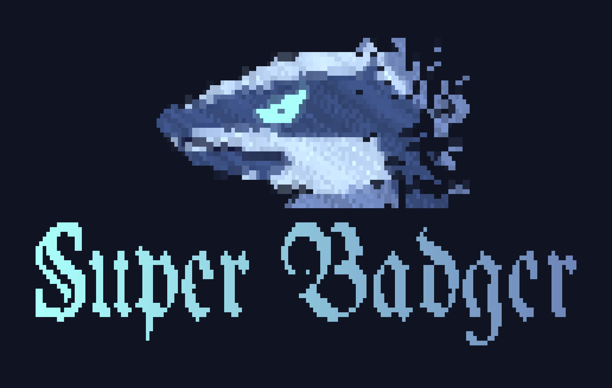

# super-badger

<p align="center">
  
</p>

A self-hosted control plane for coding agents running on **your own models**.

super-badger is **not a harness**. It doesn't run an agent loop; it sits in front
of `opencode serve` (which does) and adds what running agents against local
hardware needs and hosted-API tools don't bother with. You then use those agents
from a terminal client, a phone app, or a browser.

## Why it exists

Most agent harnesses assume a hosted API: the model is always up, the context
window is huge, and you watch the agent at your desk. Local inference breaks all
three assumptions. super-badger is built around that:

- **Is the model actually up?** Every station live-pings its model's endpoint
  (the `baseURL` from your opencode provider config: llama.cpp, vLLM, Ollama,
  …) whenever it's listed. If you stop the GPU box, the station shows
  unreachable right away, not after a prompt hangs. Hosted providers are skipped.
- **Your hardware's metrics next to the chat.** Point super-badger at any HTTP
  endpoint returning `{"<station>": {"gpu_temp": 71, "tok_s": 38.2, …}}` and
  those numbers show up on the station's top bar, with history and threshold
  alerts ("VRAM over 95%", "GPU over 85°C"). Bring your own exporter; no
  agent-side plugin needed.
- **Context you can see.** Small local context windows fill fast. Each station
  shows its live context size after every step, with thinking tokens counted
  separately, and `/compact` is one keystroke away.
- **Walk away from long runs.** Local models are slow, so runs are long. When a
  station finishes, asks for permission, asks a question, or crosses a metric
  threshold, you get a notification (Android background push, desktop, or
  terminal bell), and you can answer the permission prompt from your phone.
- **Stations, not sessions.** A *Station* is one model + one working directory +
  one persistent opencode session, with a name and a color. Keep one per
  project or per model, switch between them, and reset them when you need to.
- **Lives on the inference box.** A single Go binary with SQLite (no cgo) and a
  NixOS module that also runs opencode. It has token auth, can serve the web
  client itself, and can optionally drive Mullvad so the box can be reached
  remotely while LAN traffic to your models stays local.

## Clients

All three talk only to the server's REST + WebSocket API.

- **`superbadger` terminal client** (`tui/`, Go + Bubble Tea): streaming
  chat, inline tool calls, and permission/question prompts. It also covers
  station and metric settings and desktop notifications. `Ctrl+G` opens
  settings and `/help` lists commands.
- **Phone / web app** (`app/`, bare React Native + a Vite react-native-web
  build, one codebase): the same chat, plus metric graphs and Android
  background notifications.

```sh
nix profile install github:canavan-a/super-badger#superbadger
superbadger --server http://gpu-box:8080 --token <token>   # or set both in Settings
```

## Running it

On NixOS:

```nix
services.superbadger = {
  enable = true;
  opencode.port = 4096;   # the managed `opencode serve`
  web.enable = true;      # serve the web client on :8081
  mullvad.enable = false;
};
```

Then mint a client token on that machine with `badger token generate <label>`.
Auth kicks in once the first token exists.

Models are configured in **opencode's** provider config, not in super-badger.
Stations pick from whatever `GET /providers` reports.

For development, `nix develop` then `dev-up` / `dev-down` (opencode + server with
hot reload, logs in `.data/logs`); `dev-help` lists the rest. Server config is
environment variables: `SUPERBADGER_LISTEN_ADDR` (`:8080`),
`SUPERBADGER_DB_PATH`, `SUPERBADGER_OPENCODE_URL` (`http://127.0.0.1:4096`),
`SUPERBADGER_OPENCODE_PASSWORD`, `SUPERBADGER_STATIC_DIR`.

## Layout

- `server/`: Go API server (`cmd/superbadger-server`) and the `badger` admin
  CLI (`cmd/badger`)
- `tui/`: terminal client (its own Go module)
- `app/`: React Native + web client
- `flake.nix`, `module.nix`: dev shell, packages, NixOS module
